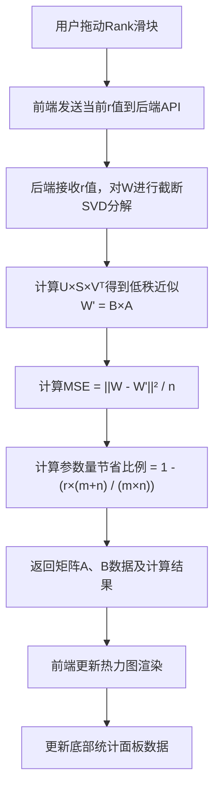

## 1. 产品概述

LoRA微调机制教学沙盒是一个交互式教学Web应用，通过可视化的方式向学生和研究者展示低秩适配（Low-Rank Adaptation, LoRA）的核心原理。用户可以通过调节秩（Rank）参数，直观地观察矩阵分解过程、参数量变化和重构误差之间的权衡关系。

- **主要目的**：通过交互式可视化帮助用户理解LoRA微调机制的数学原理和工程优势
- **解决的问题**：传统教学方式难以直观展示矩阵分解、低秩近似等抽象概念
- **目标用户**：深度学习学生、AI研究者、对大模型微调感兴趣的技术人员
- **产品价值**：将抽象的数学概念转化为直观的可视化交互，降低学习门槛

## 2. 核心特性

### 2.1 用户角色
| 角色 | 注册方式 | 核心权限 |
|------|---------|----------|
| 访客用户 | 无需注册 | 完整使用所有交互功能、调整参数、查看计算结果 |

### 2.2 功能模块
1. **主可视化面板**：三个热力图矩阵展示区域
2. **参数控制区**：秩（Rank）滑块控制器
3. **实时计算面板**：参数量节省比例和MSE误差展示
4. **教学说明区**：LoRA原理简介和公式展示

### 2.3 页面详情
| 页面名称 | 模块名称 | 功能描述 |
|---------|---------|----------|
| 主页面 | 矩阵热力图区域 | 并排展示原始大矩阵W、分解矩阵A和矩阵B的热力图，支持颜色映射和数值标签 |
| 主页面 | Rank滑块控制 | 提供1-64范围的滑块，拖动时实时更新矩阵尺寸和分解结果 |
| 主页面 | 实时计算面板 | 动态计算并展示：原始参数量、LoRA参数量、节省比例、MSE重构误差 |
| 主页面 | 矩阵尺寸显示 | 实时显示三个矩阵的维度信息（如W: 64×64, A: 64×r, B: r×64） |
| 主页面 | 教学说明区 | 简要介绍LoRA原理，展示核心公式W = W₀ + BA |

## 3. 核心流程

用户进入页面后，系统自动生成随机模拟的参数矩阵W（默认64×64），并使用默认秩值进行SVD分解。用户拖动Rank滑块时：

## 4. 用户界面设计

### 4.1 设计风格
- **主色调**：深邃科技蓝（#1a1a2e）作为背景，矩阵蓝（#4361ee）作为主色，强调色采用渐变暖色系（#f72585 到 #4cc9f0）用于热力图
- **按钮/滑块风格**：圆角设计，带有微阴影和发光悬停效果
- **字体**：JetBrains Mono 作为等宽字体用于矩阵数值展示，Inter 作为界面字体
- **布局风格**：网格化卡片布局，顶部为矩阵可视化区，中部为控制区，底部为统计面板
- **视觉元素**：使用矩阵网格纹理背景，微妙的发光效果增强科技感

### 4.2 页面设计概述
| 页面名称 | 模块名称 | UI元素 |
|---------|---------|--------|
| 主页面 | 标题区 | 渐变文字标题，副标题说明，带轻微发光动画 |
| 主页面 | 矩阵热力图区 | 三个等宽卡片，每个卡片包含矩阵标题、维度标签、Canvas热力图、颜色标尺 |
| 主页面 | 滑块控制区 | 带刻度的滑块，当前值显示，实时数值标签跟随滑块移动 |
| 主页面 | 统计面板区 | 四个统计卡片，采用不同的渐变色区分，数值变化时带有平滑过渡动画 |
| 主页面 | 公式说明区 | LaTeX格式公式展示，简洁的解释文本 |

### 4.3 响应式设计
- **桌面端**（≥1200px）：三个矩阵并排展示，统计面板横向排列
- **平板端**（768px-1199px）：矩阵改为2+1布局，统计面板自适应换行
- **移动端**（<768px）：矩阵纵向堆叠，滑块和统计面板全宽展示

### 4.4 交互与动画
- 页面加载时：矩阵热力图采用渐入动画，从模糊到清晰
- 滑块拖动：矩阵尺寸变化带有平滑过渡效果，数值变化采用数字滚动动画
- 热力图更新：颜色变化采用平滑过渡，避免闪烁
- 悬停效果：矩阵单元格悬停时显示具体数值，卡片边缘发光
