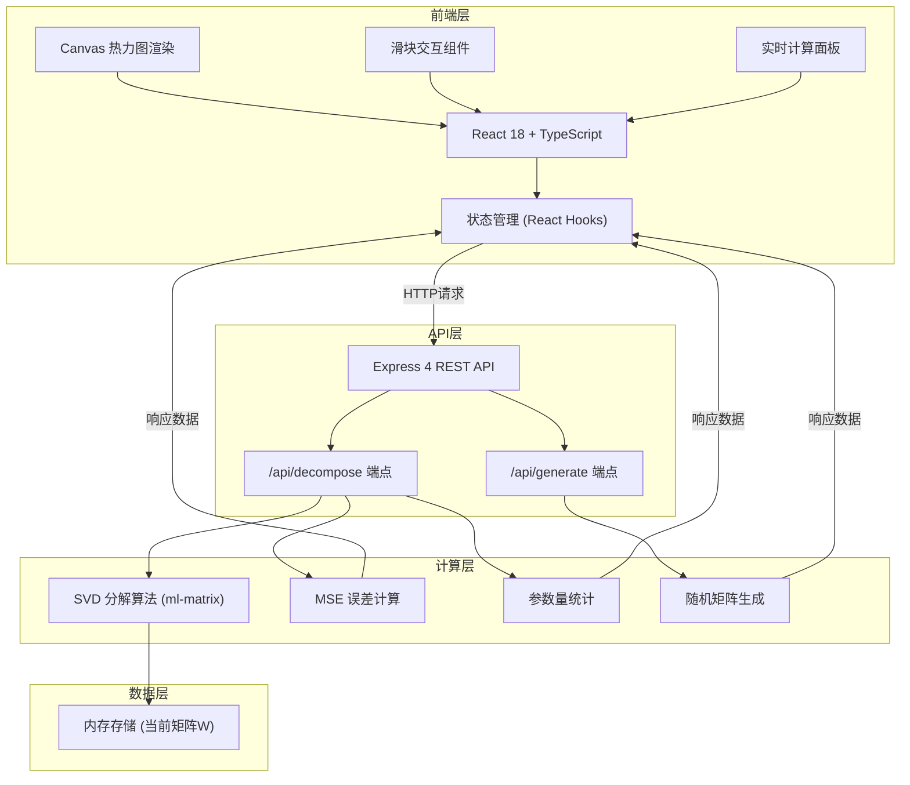
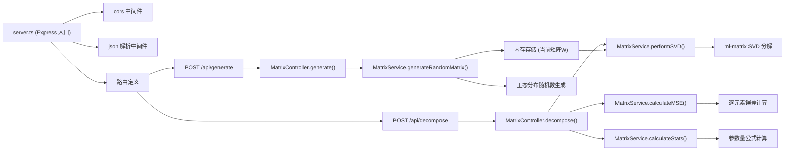

## 1. 架构设计



## 2. 技术说明

- **前端**：React@18 + TypeScript + Vite@5 + TailwindCSS@3
- **初始化工具**：vite-init
- **后端**：Express@4 + Node.js
- **数值计算**：ml-matrix（纯JS矩阵运算库，支持SVD分解）
- **可视化**：原生Canvas API绘制热力图（无需额外图表库）
- **HTTP通信**：fetch API（原生）
- **字体**：Google Fonts - Inter + JetBrains Mono

## 3. 目录结构

```
lsh-2-1/
├── client/                    # 前端项目
│   ├── src/
│   │   ├── components/
│   │   │   ├── Heatmap.tsx   # 热力图组件
│   │   │   ├── RankSlider.tsx # Rank滑块组件
│   │   │   ├── StatsPanel.tsx # 统计面板组件
│   │   │   └── MatrixCard.tsx # 矩阵卡片容器
│   │   ├── hooks/
│   │   │   └── useLora.ts     # LoRA业务逻辑Hook
│   │   ├── types/
│   │   │   └── index.ts       # TypeScript类型定义
│   │   ├── utils/
│   │   │   └── colorMap.ts    # 颜色映射工具
│   │   ├── App.tsx
│   │   ├── main.tsx
│   │   └── index.css
│   ├── index.html
│   ├── package.json
│   ├── vite.config.ts
│   └── tsconfig.json
├── server/                    # 后端项目
│   ├── src/
│   │   ├── controllers/
│   │   │   └── matrixController.ts
│   │   ├── services/
│   │   │   └── matrixService.ts
│   │   ├── types/
│   │   │   └── index.ts
│   │   └── server.ts
│   └── package.json
└── .trae/
    └── documents/
        ├── PRD.md
        └── TECH-ARCH.md
```

## 4. 路由定义

| 路由 | 目的 |
|------|------|
| / | 主页面，包含所有交互组件 |

## 5. API 定义

### 5.1 数据类型定义

```typescript
// 矩阵数据结构
interface MatrixData {
  rows: number;
  cols: number;
  data: number[][];
}

// 分解请求
interface DecomposeRequest {
  rank: number;
}

// 分解响应
interface DecomposeResponse {
  matrixW: MatrixData;      // 原始矩阵 m×n
  matrixA: MatrixData;      // 右矩阵 n×r
  matrixB: MatrixData;      // 左矩阵 r×m
  matrixReconstructed: MatrixData; // 重构矩阵 W' = B×A
  stats: {
    originalParams: number;      // 原始参数量 m×n
    loraParams: number;          // LoRA参数量 r×(m+n)
    savingRatio: number;         // 节省比例 0-1
    mse: number;                 // 均方误差
  };
}

// 生成矩阵请求
interface GenerateRequest {
  rows?: number;  // 默认64
  cols?: number;  // 默认64
  seed?: number;  // 随机种子，可选
}

// 生成矩阵响应
interface GenerateResponse {
  matrixW: MatrixData;
  seed: number;
}
```

### 5.2 API 端点

#### POST /api/decompose
对当前存储的矩阵进行指定秩的SVD分解

**请求体**：
```json
{
  "rank": 8
}
```

**响应**：`DecomposeResponse`

#### POST /api/generate
生成新的随机矩阵

**请求体**（可选）：
```json
{
  "rows": 64,
  "cols": 64,
  "seed": 42
}
```

**响应**：`GenerateResponse`

## 6. 后端架构图



## 7. 核心算法说明

### 7.1 SVD 低秩分解流程
1. 对原始矩阵W(m×n)进行SVD分解：W = U×S×Vᵀ
2. 取前r个奇异值，得到截断的U_r(m×r), S_r(r×r), V_r(r×n)
3. 计算低秩近似：W_r = U_r × S_r × V_rᵀ
4. 将W_r分解为两个矩阵：B = U_r × sqrt(S_r), A = sqrt(S_r) × V_rᵀ
5. 这样 W_r ≈ B × A，其中B是r×m，A是m×r（根据LoRA convention调整维度）

### 7.2 MSE 计算
MSE = (1/(m×n)) × ΣᵢΣⱼ (W[i][j] - W'[i][j])²

### 7.3 参数量节省计算
- 原始参数量：m × n
- LoRA参数量：r × (m + n)
- 节省比例：1 - (r × (m + n)) / (m × n)

## 8. 前端性能优化
- 使用 Canvas 而非 DOM 渲染热力图，支持64×64=4096个单元格流畅更新
- 滑块采用防抖（debounce）处理，避免频繁API请求（100ms延迟）
- 矩阵数据使用 Float32Array 传输，减小网络开销
- 使用 requestAnimationFrame 实现平滑的颜色过渡动画
